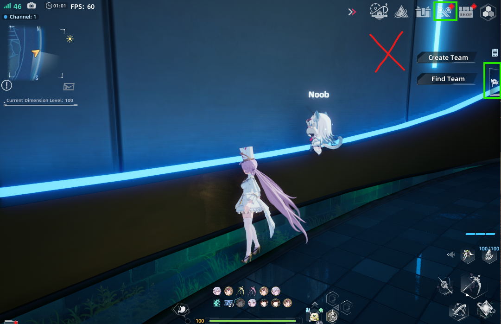
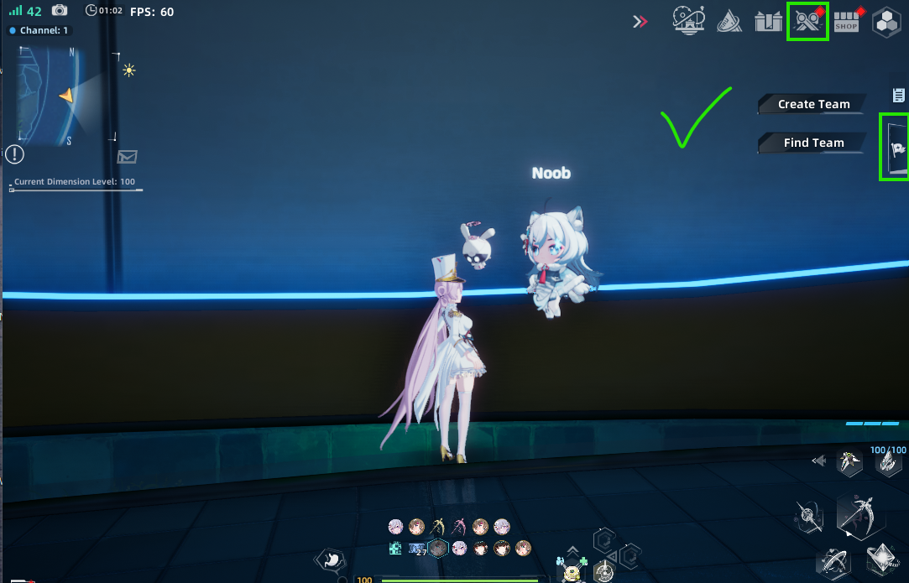

# ToF Auto CA

Automates the **Critical Abyss** farm loop in *Tower of Fantasy* across three
game clients. It presses the buttons you would press: leave the party, open the
team lobby, queue, request, approve, queue the alt, sit through the run, and
leave near the end — then starts over.

It drives the game the way a person does — it moves the real cursor and sends
real key presses to focused windows. Nothing is injected into the game, no files
are read from it, and no packets are touched. It only looks at pixels: every
screen is identified by OCR'ing the text on it (via the OCR engine built into
Windows) and by matching a handful of small icon images you capture yourself.

> **Windows only.** It relies on Windows OCR, Win32 window handles and DirectInput.


## HOW TO USE - IMPORTANT

**DO NOT put yourself in the position that might cover up the icons that need to be seen clearly. It's best if you face yourself to a clean background**




## Getting started

1. Launch all three ToF clients, logged in, **windowed at 1080x720** (the
   resolution the bundled icon templates were captured at).
2. Start the app (**as administrator** if the game runs elevated — hotkeys only
   reach windows at the same level).
3. For each role — `mainhost`, `main`, `althost` — type its in-game username,
   focus that client, press **Ctrl+Enter**, confirm the screenshot.
4. Press **🔍 Detect states (dry-run)** to check all three windows read cleanly.
5. Press **▶ Start CA loop**.

Usernames and window process ids are remembered, so subsequent launches go
straight to the control panel — no re-binding unless a client was restarted.

Scrolldown to troubleshoot

## Download

1. Grab `ToF-Auto-CA-v1.0.zip` from the [Releases](../../releases) page.
2. Unzip it anywhere you like — for example `D:\ToF-Auto-CA\`.
3. Keep the folder together:

   ```
   ToF-Auto-CA.exe     the app
   templates\          icon images + manifest.json  (needed)
   config.json         your usernames and settings  (written by the app)
   replays\            created later, only when something fails
   ```

   The exe reads and writes those files **from beside itself**, so don't move the
   exe out on its own.

4. Windows SmartScreen will likely warn about an unsigned app — *More info →
   Run anyway*. If Defender quarantines it, add an exclusion for the folder.


### Is it working?

```
ToF-Auto-CA.exe --selftest
```

Runs a quick check of the runtime paths, the icon templates and the OCR engine,
prints the result and writes `selftest.txt` next to the exe. Everything should
say `[ok]`.

---

## Before you start

- **Three ToF clients running and logged in**, one per role:

  | Role | What it does |
  | --- | --- |
  | `mainhost` | Hosts the party, presses **Go**, approves the join request, leaves the instance near the end |
  | `main` | Leaves the party each round, then requests to join `mainhost` |
  | `althost` | Queues Critical Abyss separately through Priority → Challenge → Arena |

- **Set every client to 1080x720, windowed.** That is the resolution the bundled
  icon templates were captured at, and the one the app is tested on. Other
  resolutions are **not guaranteed to work**: icon matching allows for some
  scaling, but a different resolution or in-game UI scale moves and redraws HUD
  elements, so templates may stop matching. If you must run something else,
  expect to recapture the icons with **F8** (see below) and to re-check the
  OCR crop regions in `config.json`.
- **Windowed (not minimized).** Screens are captured from the screen, so a
  minimized or fully covered window can't be read. They may overlap while idle —
  the app focuses whichever one it needs.
- **Run as Administrator if the game runs elevated.** Global hotkeys and input
  only reach a window at the same elevation level. Right-click →
  *Run as administrator*.
- **Don't use the PC while the loop runs.** It takes over the cursor and keyboard
  focus and switches between windows. Stop it before you need the machine.

---

## First run

### 1. Bind the three windows

The app asks for the roles one at a time, in order: `mainhost`, `main`,
`althost`. For each:

1. Type that account's **in-game username** in the text box (exact spelling —
   party rows are found by name).
2. **Click the game window for that role** so it is focused.
3. Press **Ctrl+Enter**. The app screenshots whatever window is focused.
4. Check the preview, then **✓ Confirm** (or **↺ Retry capture** if it grabbed
   the wrong window).

Usernames and each window's process id are saved to `config.json`. On later
launches those process ids are re-used, so **as long as the clients stay open you
never have to do this again** — the app goes straight to the control panel. Only
a role whose client was restarted needs recapturing.

### 2. Capture the icon templates (F8)

Most of the UI is found by reading its text, but a few buttons are pictures with
no label. Those are matched against small images you capture:

| Template | What to capture |
| --- | --- |
| `team_toggle` | Overworld side-panel team/quest toggle (the flag, right edge) |
| `priority_entry` | Overworld button that opens the Priority panel |
| `team_lobby_tab` | The **Team Lobby** tab in the Lobby |
| `priority_challenge_tab` | The **Challenge** tab icon in the Priority side nav |
| `arena_tile` | The **Arena** tile on Priority → Challenge |
| `arena_ca_selected` | The Arena **The Critical Abyss** tab while *selected* |
| `ca_leave` | The leave button (top-left HUD) inside the CA instance |
| `overworld_marker` | Top-right HUD scanner/order icon — present in the overworld, absent in the instance |

To capture one: focus the game window showing it, press **F8**, drag a box around
the icon, pick its name, and save. The release ships with a working set, so try
the loop first and only capture what misbehaves.

**Variants.** A button that has more than one look (a red-dot badge, a "new" tag,
a different background when your party list is on screen) can be saved several
times — tick *additional variant* and it is stored as `team_toggle#2`,
`priority_entry#3`, and so on. Any variant matching is enough, so adding one for
a state that fails is the normal fix.

### 3. Run it

- **🔍 Detect states (dry-run)** — reads all three windows and reports what screen
  each one is on. Start here: it confirms the windows are bound and readable
  without touching anything.
- **▶ Start CA loop** — runs the full loop until you stop it.
- **■ Stop** — finishes the current action and stops. Closing the window also
  stops it.

The log pane timestamps every step, so you can leave it running and read back
what happened.

---

## What the loop does

1. **main** leaves the party (*Quit Team* → *Leave the team?* → OK).
2. **mainhost** opens the team lobby and presses **Go**, then checks that
   matchmaking actually started.
3. **main** opens Team Lobby → The Critical Abyss → **Request** on mainhost's row.
4. **mainhost** opens its request list and **Approves** main's request.
5. **althost** goes Priority → Challenge → Arena → Critical Abyss → **Find
   matches**, and checks the queue started.
6. Everyone plays. The app leaves the windows alone for the first 4 minutes, then
   watches **mainhost's** countdown; once it drops below 27:00 mainhost leaves the
   instance (main and althost return on their own). Then the loop restarts.

### When the game says no

A queue button that does nothing is not treated as a dead end — the app reads
the game's own **System chat log** (Esc to the overworld → Enter → **System**) to
find out why, and reacts:

| What the log says | What happens |
| --- | --- |
| *"&lt;player&gt; is not ready."* / *"is offline."* | Presses the button again every 20s, up to 10 times, then stops |
| *"Matching cooldown ends in 2 min 25 sec."* / *"Matching banned for 5 minutes."* | Waits out the stated time and presses again |
| *"Event unavailable"* | Stops — Critical Abyss is closed, retrying can't help |
| anything else | A few quick retries |

Retries always press **the same button on the same screen**; the loop never
rebuilds a party that is already formed.

---

## When something goes wrong

**Replays.** Any failed step dumps the last ~5 minutes of all three windows to
`replays\<timestamp>_<what failed>\<role>.mp4`. That is usually enough to see
what the game was showing.

| Symptom | Likely cause |
| --- | --- |
| `team_toggle template is loaded but did not match` | The icon's background changed (party health bars behind it are the usual culprit). Press **F8** on that screen and save a variant. |
| `Go button not found on the lobby` | The window was covered or minimized when it was read. |
| A step keeps retrying on one screen | An icon template doesn't match your resolution or UI scale — set the client to **1080x720**, or recapture the icon with **F8**. |
| Hotkeys do nothing | Another app owns Ctrl+Enter or F8, or the game is elevated and the app isn't — run as administrator. |
| `Restored <role> from PID … not found` | That client was restarted. Set its `pid` to `null` in `config.json` and relaunch to recapture just that role. |

### `config.json`

Written by the app, safe to hand-edit while it is closed:

```jsonc
{
  "roles": {
    "mainhost": {
      "username": "YourHostName",         // exact in-game name (party rows are matched by it)
      "window_title_hint": "Tower of Fantasy",
      "pid": 15084                         // set to null to force a recapture
    }
  },
  "points":  {},                           // optional fallback click points, normalized 0..1
  "regions": {}                            // optional OCR crop overrides, e.g. "ca_timer"
}
```

`templates\manifest.json` holds each icon's search region and match threshold and
is hand-editable too — raise a threshold if something matches when it shouldn't,
lower it if a good icon is being missed.

---

## Building from source

Requires Windows and Python 3.12.

```bat
python -m venv .venv
.venv\Scripts\python.exe -m pip install -r requirements.txt
.venv\Scripts\python.exe main.py          REM run from source
```

To produce the exe (needs `pip install pyinstaller`):

```bat
.venv\Scripts\python.exe build.py
```

That runs `tof-auto-ca.spec` and stages `templates\` and a blank `config.json`
beside `dist\ToF-Auto-CA.exe`. Ship the whole `dist\` folder.

There is also `run.bat`, which launches the source version elevated via UAC.

